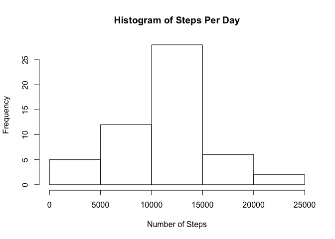
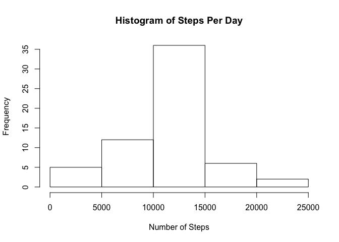
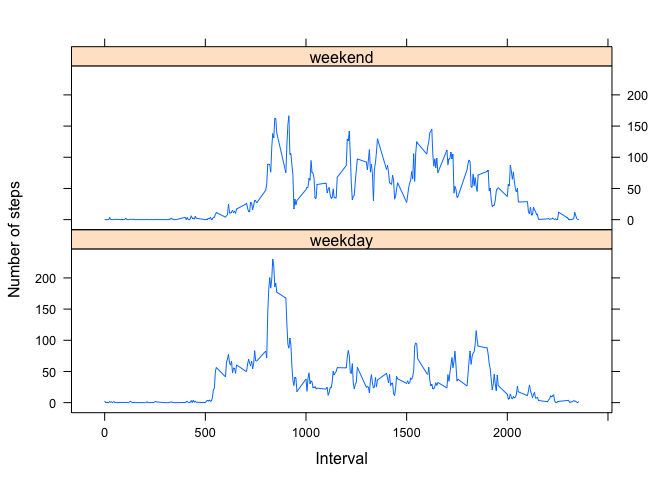

# Reproducible Research: Peer Assessment 1


## Loading and preprocessing the data

```r
activity<-read.csv("activity.csv")
activity$date<-as.Date(activity$date,format="%Y-%m-%d")
```

## What is mean total number of steps taken per day?

```r
perday<-aggregate(.~activity$date,data=activity,sum,na.rm=TRUE)
hist(perday$steps,main="Histogram of Steps Per Day",ylab="Frequency",xlab="Number of Steps")
```

<!-- -->

```r
mean1<-mean(perday$steps,na.rm=TRUE)
mean1
```

```
## [1] 10766.19
```

```r
median1<-median(perday$steps,na.rm=TRUE)
median1
```

```
## [1] 10765
```


## What is the average daily activity pattern?

```r
perint<-aggregate(.~activity$interval,data=activity,mean,na.rm=TRUE)
with(perint,plot(interval,steps,type="l"))
```

<!-- -->

Which 5-minute interval, on average across all the days in the dataset, contains the maximum number of steps?

```r
max<-max(perint$steps)
perint[perint$steps==max,4]
```

```
## [1] 835
```

## Imputing missing values
Fill in all of the missing values in the dataset using the mean steps for each interval.  Create a new dataset that is equal to the original dataset but with the missing data filled in.

```r
sum(is.na(activity$steps))
```

```
## [1] 2304
```

```r
empty<-activity[is.na(activity$steps),]
merge<-merge(empty[,c(2,3)],perint[,c(2,4)],by="interval")
full<-rbind(merge,activity[complete.cases(activity),])
```
## Are there differences in activity patterns between weekdays and weekends?

```r
perday2<-aggregate(.~full$date,data=full,sum)
hist(perday2$steps,main="Histogram of Steps Per Day",ylab="Frequency",xlab="Number of Steps")
mean2<-mean(perday2$steps)
        mean2
```

```
## [1] 10766.19
```

```r
median2<-median(perday2$steps)
	median2
```

```
## [1] 10766.19
```

```r
mean1-mean2
```

```
## [1] 0
```

```r
median1-median2
```

```
## [1] -1.188679
```

```r
library(lubridate)
```

```
## 
## Attaching package: 'lubridate'
```

```
## The following object is masked from 'package:base':
## 
##     date
```

```r
ifweekday<-function (x) {if(wday(x)==1){"weekend"}else if (wday(x)==7){"weekend"} else {"weekday"}}
day<-sapply(full$date,ifweekday)
new<-cbind(full,day)
intday<-aggregate(.~day+interval,data=new,mean)
library(lattice)
```

<!-- -->

```r
xyplot(intday$steps~intday$interval|intday$day,layout=c(1,2),type="l",ylab="Number of steps",xlab="Interval")
```

<!-- -->
